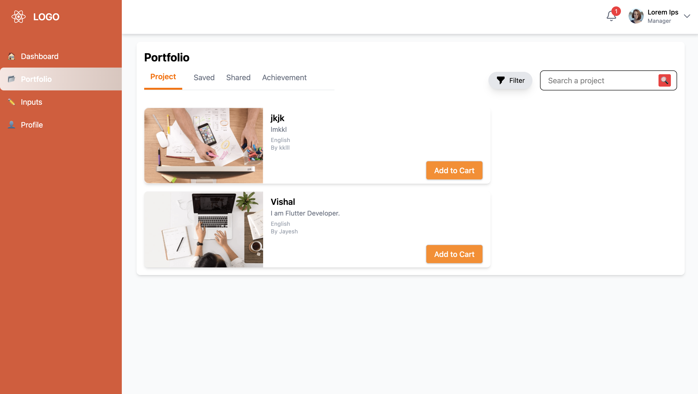
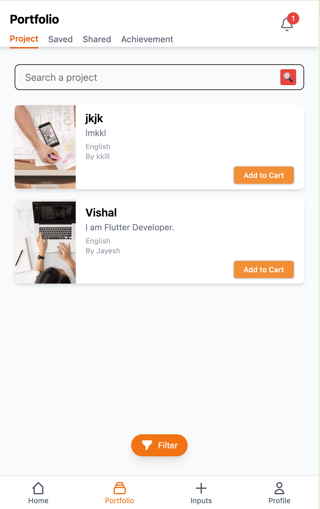
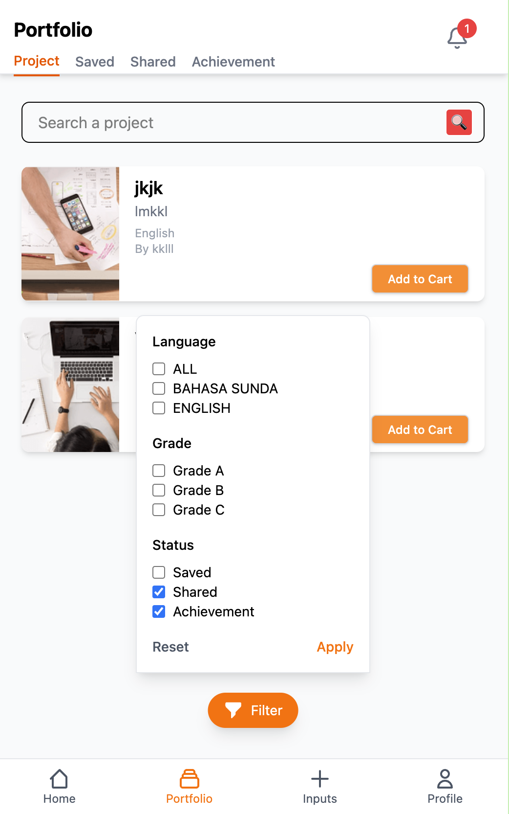

# 🚀 Portfolio(using Backend)

## 🌟 Overview

This is my portfolio website, built with **React (Vite) for the frontend** and **Strapi for the backend**. The website is fully responsive, ensuring a seamless experience across web and mobile devices.

## 🛠️ Tech Stack

- **Frontend:** React (Vite), Tailwind CSS
- **Backend:** Strapi (Headless CMS)
- **Database:** MySql
- **Deployment:**
  - Frontend → [[Vercel](https://vercel.com/)](https://portfolio-backend-beta-coral.vercel.app/)

## ✨ Features

- **Fully Responsive:** Optimized for both desktop and mobile devices.
- **Dynamic Content Management:** Managed via Strapi for easy updates.
- **Modern UI:** Clean and minimalistic design.
- **Fast Performance:** Powered by Vite for optimized builds.

## 📸 Screenshots

### 💻 Desktop View

### 📱 Mobile View

### 📱 Mobile View(Filter)

## 🌐 Live Demo

- **Frontend (Vercel):** https://portfolio-backend-beta-coral.vercel.app/

## 📬 Contact

If you have any questions or feedback, feel free to reach out!

- **Email:** jainjayesh2003@gmail.com
- **LinkedIn:** https://www.linkedin.com/in/jayesh-jain-8b65bb188/

